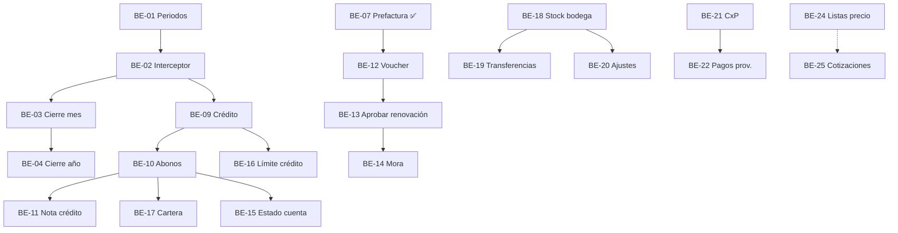

# Plan backend MVP-2 — 30 días

Plan de trabajo para cerrar **los 27 issues BE abiertos** del milestone **MVP-2**.

| Campo | Valor |
|-------|--------|
| **Inicio sugerido** | 2026-07-01 |
| **Fin objetivo** | 2026-07-30 |
| **Semana laboral** | **7 días** (sin excluir sábado/domingo) |
| **Alcance** | Solo **backend** (`snapbill-backend`) |
| **Ya cerrados** | BE-05 (trial), BE-07 (prefactura) — fuera de este plan |

## Reglas de cierre por día

Al terminar cada **BE-##**:

1. `dotnet build` + `dotnet test` en `snapbill-backend`
2. Migración EF aplicable en dev (AppHost)
3. Actualizar `docs/modelo_datos.md` y `docs/scripts_ddl.sql` si hay cambio de esquema
4. Crear/actualizar `docs/api-contracts/BE-XX.md` → estado **`implementado`**
5. Comentar en issue **FE** pareado (si existe): enlace al contrato; quitar label `blocked`
6. Cerrar issue **BE-##** con enlace al PR/commit

**Comando al agente:** `Implementa BE-XX` o `Implementa backlog #N`

---

## Resumen por bloque

| Bloque | Días | Issues | Acumulado |
|--------|------|--------|-----------|
| 1 · Control fiscal | 1–7 | BE-01 → 04, BE-08 | 5 |
| 2 · Ciclo SaaS | 8–11 | BE-12 → 14, BE-06 | 4 |
| 3 · Cuentas por cobrar (P0) | 12–15 | BE-09 → 11 | 3 |
| 4 · Catálogo productos | 16–17 | BE-27, BE-28 | 2 |
| 5 · Inventario multi-bodega | 18–21 | BE-18 → 20 | 3 |
| 6 · CxC y reportes (P1) | 22–24 | BE-16, 17, 15 | 3 |
| 7 · Compras y ventas avanzadas (P2) | 25–29 | BE-21 → 25 | 5 |
| 8 · Cierre y regresión | 30 | BE-26, BE-29, QA | 2 |

**Total issues:** 27

---

## Calendario día a día

### Bloque 1 — Control fiscal (días 1–7)

| Día | Fecha* | Issue | Entregable principal | Contrato |
|-----|--------|-------|----------------------|----------|
| **1** | 01 jul | **BE-01** (día 1) | Entidades `FiscalYear`, `TenantPeriod`; CRUD períodos; seed/inicialización | `BE-01.md` borrador |
| **2** | 02 jul | **BE-01** (cierre) | Reglas de coexistencia; tests; cerrar BE-01 | `BE-01.md` ✅ |
| **3** | 03 jul | **BE-02** | Interceptor transacciones por fecha documento (factura, OC, recepción, ajustes futuros) | `BE-02.md` ✅ |
| **4** | 04 jul | **BE-03** (día 1) | Cierre de mes; snapshot MCPP / histórico operativo | `BE-03.md` borrador |
| **5** | 05 jul | **BE-03** (cierre) | Validaciones periodo cerrado; tests | `BE-03.md` ✅ |
| **6** | 06 jul | **BE-04** | Cierre fiscal anual; `ProductFiscalOpenings`; candado año | `BE-04.md` ✅ |
| **7** | 07 jul | **BE-08** + buffer | Validación `minimumStock > 0`; regresión fiscal manual | `BE-08.md` ✅ |

\*Fechas ajustables; mantener orden y dependencias.

**Dependencias:** BE-02 requiere BE-01 · BE-03 requiere BE-02 · BE-04 requiere BE-03 (12 meses cerrados).

**Hito bloque 1:** API rechaza documentos en periodos cerrados; cierre mes/año operativo.

---

### Bloque 2 — Ciclo SaaS renovación (días 8–11)

| Día | Fecha* | Issue | Entregable principal |
|-----|--------|-------|----------------------|
| **8** | 08 jul | **BE-12** | `POST .../subscription-payments/{id}/voucher` contra prefactura `PendingPayment` |
| **9** | 09 jul | **BE-13** | `PATCH .../approve-renewal`; extensión `NextBillingDate`; rechazo |
| **10** | 10 jul | **BE-14** | Job Quartz mora; suspensión automática; email |
| **11** | 11 jul | **BE-06** | Upgrade trial → plan pago; conservar tenant |

**Dependencias:** BE-12 → BE-13; BE-07 ✅ ya implementado.

**Hito bloque 2:** Renovación prefactura end-to-end en API.

**FE desbloqueados (paralelo opcional):** FE-08, FE-09, FE-10, FE-04.

---

### Bloque 3 — Cuentas por cobrar P0 (días 12–15)

| Día | Fecha* | Issue | Entregable principal |
|-----|--------|-------|----------------------|
| **12** | 12 jul | **BE-09** | Factura `PaymentTerms.Credito`; `BalanceDue`, `PaymentStatus`, `DueDate` |
| **13** | 13 jul | **BE-10** | `POST .../invoices/{id}/payments`; abonos parciales |
| **14** | 14 jul | **BE-11** (día 1) | Entidad nota crédito; reversión stock; impacto CxC |
| **15** | 15 jul | **BE-11** (cierre) | PDF nota crédito; tests; cerrar BE-11 |

**Dependencias:** BE-09 → BE-10 → BE-11; BE-02 interceptor aplica.

**Hito bloque 3:** Venta a crédito + abono + nota crédito en API.

**FE desbloqueados:** FE-05, FE-06, FE-07.

---

### Bloque 4 — Catálogo productos (días 16–17)

| Día | Fecha* | Issue | Entregable principal |
|-----|--------|-------|----------------------|
| **16** | 16 jul | **BE-27** | `IsActive`; activate/deactivate; bloqueo en factura/OC/recepción |
| **17** | 17 jul | **BE-28** | `UnitOfMeasure`; catálogo unidades; PDFs con unidad |

**Hito bloque 4:** Productos con baja lógica y unidad de medida.

**FE desbloqueados:** FE-23, FE-24.

---

### Bloque 5 — Inventario multi-bodega (días 18–21)

| Día | Fecha* | Issue | Entregable principal |
|-----|--------|-------|----------------------|
| **18** | 18 jul | **BE-18** (día 1) | `WarehouseStocks`; migración stock global; recepción con bodega |
| **19** | 19 jul | **BE-18** (cierre) | Factura con `warehouseId`; kardex por bodega; cerrar BE-18 |
| **20** | 20 jul | **BE-19** | Transferencias entre bodegas |
| **21** | 21 jul | **BE-20** | Ajustes inventario (merma, conteo, corrección) |

**Dependencias:** BE-19, BE-20 requieren BE-18 · BE-27 recomendado antes.

**Hito bloque 5:** Stock por bodega operativo.

**FE desbloqueados:** FE-13, FE-14, FE-15.

---

### Bloque 6 — CxC y reportes P1 (días 22–24)

| Día | Fecha* | Issue | Entregable principal |
|-----|--------|-------|----------------------|
| **22** | 22 jul | **BE-16** | `CreditLimit` en cliente; bloqueo venta crédito |
| **23** | 23 jul | **BE-17** | Reporte cartera JSON + PDF antigüedad saldos |
| **24** | 24 jul | **BE-15** | Estado de cuenta cliente PDF |

**Dependencias:** BE-16, 17, 15 requieren BE-09/10.

**FE desbloqueados:** FE-11, FE-12, FE-16.

---

### Bloque 7 — Compras y ventas avanzadas P2 (días 25–29)

| Día | Fecha* | Issue | Entregable principal |
|-----|--------|-------|----------------------|
| **25** | 25 jul | **BE-21** | Facturas proveedor (CxP) |
| **26** | 26 jul | **BE-22** | Pagos proveedores; reporte CxP |
| **27** | 27 jul | **BE-23** | Devolución a proveedor |
| **28** | 28 jul | **BE-24** | Listas de precios |
| **29** | 29 jul | **BE-25** | Cotizaciones + conversión a factura |

**Dependencias:** BE-22 requiere BE-21 · BE-25 opcional BE-24 · BE-18 para BE-23 bodega.

**FE desbloqueados:** FE-17 → FE-21.

---

### Bloque 8 — Cierre milestone (día 30)

| Día | Fecha* | Actividad |
|-----|--------|-----------|
| **30** | 30 jul | **BE-26** reporte margen/utilidad PDF |
| | | **BE-29** barcode + `GET /by-barcode/{code}` |
| | | Regresión integral: fiscal + SaaS + CxC + inventario |
| | | Actualizar índice `docs/api-contracts/README.md` |
| | | Cerrar milestone **MVP-2** (backend) en GitHub |

---

## Mapa de dependencias

---

## Checklist de cierre MVP-2 backend

- [ ] 27 issues BE abiertos → **cerrados**
- [ ] 27 archivos `docs/api-contracts/BE-XX.md` en estado **implementado** (donde aplique HTTP)
- [ ] `modelo_datos.md` y `scripts_ddl.sql` alineados en `snapbill-backend`
- [ ] Suite de tests verde en CI/local
- [ ] Índice [api-contracts/README.md](./api-contracts/README.md) actualizado

---

## Riesgos y mitigación

| Riesgo | Mitigación |
|--------|------------|
| BE-01 o BE-18 se alargan | Usar días 7 y 19 como buffer parcial; mover BE-26/29 al día 31 si hace falta |
| Fatiga (semana de 7) | Día 7 y 15 solo regresión ligera; no apilar dos issues grandes el mismo día |
| FE esperando | Al cerrar cada BE, comentar en FE y quitar `blocked` aunque FE se implemente después |

---

## Issues BE — referencia rápida

| Issue | GitHub | Prioridad |
|-------|--------|-----------|
| BE-01 | [#1](https://github.com/gustavorodriguez1984/snapbill-backlog/issues/1) | P0 |
| BE-02 | [#2](https://github.com/gustavorodriguez1984/snapbill-backlog/issues/2) | P0 |
| BE-03 | [#3](https://github.com/gustavorodriguez1984/snapbill-backlog/issues/3) | P0 |
| BE-04 | [#4](https://github.com/gustavorodriguez1984/snapbill-backlog/issues/4) | P0 |
| BE-06 | [#11](https://github.com/gustavorodriguez1984/snapbill-backlog/issues/11) | P0 |
| BE-08 | [#10](https://github.com/gustavorodriguez1984/snapbill-backlog/issues/10) | P1 |
| BE-09 | [#12](https://github.com/gustavorodriguez1984/snapbill-backlog/issues/12) | P0 |
| BE-10 | [#13](https://github.com/gustavorodriguez1984/snapbill-backlog/issues/13) | P0 |
| BE-11 | [#14](https://github.com/gustavorodriguez1984/snapbill-backlog/issues/14) | P0 |
| BE-12 | [#15](https://github.com/gustavorodriguez1984/snapbill-backlog/issues/15) | P0 |
| BE-13 | [#16](https://github.com/gustavorodriguez1984/snapbill-backlog/issues/16) | P0 |
| BE-14 | [#17](https://github.com/gustavorodriguez1984/snapbill-backlog/issues/17) | P0 |
| BE-15 | [#18](https://github.com/gustavorodriguez1984/snapbill-backlog/issues/18) | P1 |
| BE-16 | [#19](https://github.com/gustavorodriguez1984/snapbill-backlog/issues/19) | P1 |
| BE-17 | [#20](https://github.com/gustavorodriguez1984/snapbill-backlog/issues/20) | P1 |
| BE-18 | [#21](https://github.com/gustavorodriguez1984/snapbill-backlog/issues/21) | P1 |
| BE-19 | [#22](https://github.com/gustavorodriguez1984/snapbill-backlog/issues/22) | P1 |
| BE-20 | [#23](https://github.com/gustavorodriguez1984/snapbill-backlog/issues/23) | P1 |
| BE-21 | [#24](https://github.com/gustavorodriguez1984/snapbill-backlog/issues/24) | P2 |
| BE-22 | [#25](https://github.com/gustavorodriguez1984/snapbill-backlog/issues/25) | P2 |
| BE-23 | [#26](https://github.com/gustavorodriguez1984/snapbill-backlog/issues/26) | P2 |
| BE-24 | [#27](https://github.com/gustavorodriguez1984/snapbill-backlog/issues/27) | P2 |
| BE-25 | [#28](https://github.com/gustavorodriguez1984/snapbill-backlog/issues/28) | P2 |
| BE-26 | [#29](https://github.com/gustavorodriguez1984/snapbill-backlog/issues/29) | P2 |
| BE-27 | [#49](https://github.com/gustavorodriguez1984/snapbill-backlog/issues/49) | P1 |
| BE-28 | [#50](https://github.com/gustavorodriguez1984/snapbill-backlog/issues/50) | P1 |
| BE-29 | [#51](https://github.com/gustavorodriguez1984/snapbill-backlog/issues/51) | P2 |

---

*Documento vivo: ajustar fechas al iniciar el sprint; marcar días completados con PR enlazado.*
